# Keras deeplabV3+ semantic segmentation model using MobileNetV2 as a base model.
## Keras based deeplabV3+ has been developed via referring to [Encoder-Decoder with Atrous Separable Convolution for Semantic Image Segmentation](https://arxiv.org/abs/1802.02611) and [the relevant github repository](https://github.com/tensorflow/models/tree/master/research/deeplab).

The deeplabV3+ semantic segmentation model is mainly composed of the encoder and decoder using atrous spatial pooling and separable depthwise convolution. 
Focusing on Keras deeplabV3+ with MobileNetV2 as a base model, this encoder and decoder become much more simplified. In the decoder, when using MobileNetV2, 
simple upsampling is applied according to the github repository's source code.

# Tasks
- [x] Encoder develop.
- [x] Decoder develop.
- [x] Training and evaluating with Pasal VOC 2012 dataset.
- [x] Documentation.

## Test environments
The semantic segmentation model has been developed and tested on Windows(Windows 10, cpu: Intel COre i7-6700HQ CPU 2.60 GHz), Anaconda 4.6.14, Python 3.6.8, Tensorflow 1.13.1 (Keras's backend), Keras 2.2.4 and on 4 CPUs, 16 GB memory, 1 x GeForce GTX 960M (4097 MiB).

## Training and testing procedure
### Install [Anaconda](https://docs.anaconda.com/anaconda/install/windows/)

### After installing Anaconda, create the environment

```conda create -n tf36 python=3.6```

### Go to the created environment

```conda activate tf36```

### Install [CUDA Toolkit 10.1](https://developer.nvidia.com/cuda-downloads?target_os=Linux&target_arch=x86_64&target_distro=Ubuntu&target_version=1604&target_type=debnetwork)

### Install [cuDNN v7.6.0 for CUDA 10.1](https://developer.nvidia.com/rdp/cudnn-download) 

### Install necessary python packages

```pip install -r requrements.txt```

### Download the git repository

```git clone https://github.com/tonandr/ai-platform.git```

```cd ai-platform\tasks\computer-vision\semantic-segmentation```

### Prepare dataset and make the resource directory
The Pascal VOC 2012 dataset can be obtained from [PASCAL VOC 2012](https://pjreddie.com/projects/pascal-voc-dataset-mirror/).
Unzip VOCtrainval_11-May-2012.tar, make the 'resource' directory in deeplabv3plus_keras, copy VOCdevkit into the resource directory recursively and make the 'results' directory in the resource directory for semantic segmentation result images.  

### Configuration json format file (semantic_segmentation_deeplabv3plus_conf_win.json)

```
{
	"mode" : "train",
	"raw_data_path" : "D:\\workspace\\ai-platform\\tasks\\computer-vision\\semantic-segmentation\\deeplabv3plus_keras\\resource",
	"model_loading" : false,
	"multi_gpu" : false,
	"num_gpus" : 4,
	"hps" : {
		"lr" : 0.0001,
		"beta_1" : 0.5,
		"beta_2" : 0.99,
		"decay" : 0.0,
		"epochs" : 120,
		"batch_size" : 6,
		"weight_decay": 0.00004,
		"bn_momentum": 0.1,
		"bn_scale": true,
		"reduce_lr_factor": 0.99999
	},
	"nn_arch" : {
		"output_stride": 8,
		"image_size": 224,
		"num_classes": 21,
		"mv2_depth_multiplier": 1,
		"depth_multiplier": 1,
		"conv_rate_multiplier" : 2,
		"reduction_size": 256,
		"dropout_rate": 0.1,
		"concat_channels": 256,
		"encoder_middle_conf": [
			{"kernel": 3, "rate": [1, 6], "op": "conv", "input": -1}, 
			{"kernel": 3, "rate": [18, 15], "op": "conv", "input": 0}, 
			{"kernel": 3, "rate": [6, 3], "op": "conv", "input": 1}, 
			{"kernel": 3, "rate": [1, 1], "op": "conv", "input": 0}, 
			{"kernel": 3, "rate": [6, 21], "op": "conv", "input": 0}
		]	 
	}
}
```

### First, train the face detection model 

You should set mode to "train". For accelerating computing, you can set multi_gpu to true and the number of gpus. To use a pretrained mdoel, you can set model_loading to true.
You can download [the pretrained semantic_segmentation](https://www.dropbox.com/s/h65e74acv8szk29/semantic_segmentation_deeplabv3plus.h5?dl=1).

```python semantic_segmentation.py```

### Evaluate the model via generating result images.

Set mode to 'evaluate, and you should set model_loading to true.

```python semantic_segmentation.py```

# Performance
## Mean IoU
With MobileNetV2, 6 batch size, 224x224 image size, about 83.936k iterations, the model has been trained, yet the performance is much lower than the final mean iou of the reference paper's method. Due to the gpu's performance limit, with enough batch size and epochs, the model wasn't trained. With enough batch size and epochs, this model's performance can be enhanced.

| data type | training | validation |
|-----------|----------|------------|
| mean iou  |   0.215  |   0.098    |

## Result labels
[Results about training data](https://www.dropbox.com/s/163xxv19jlayac7/results.zip?dl=1)

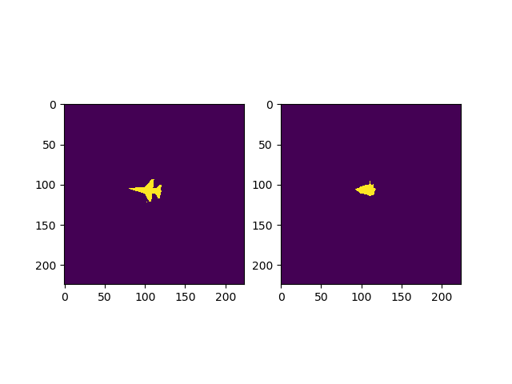 
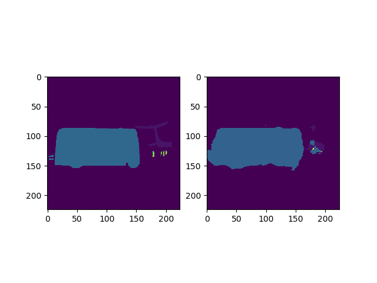
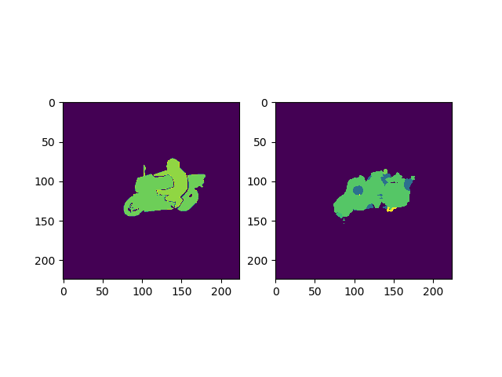
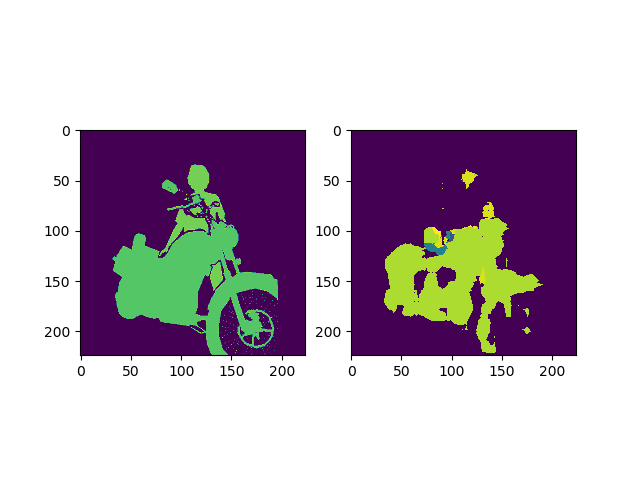
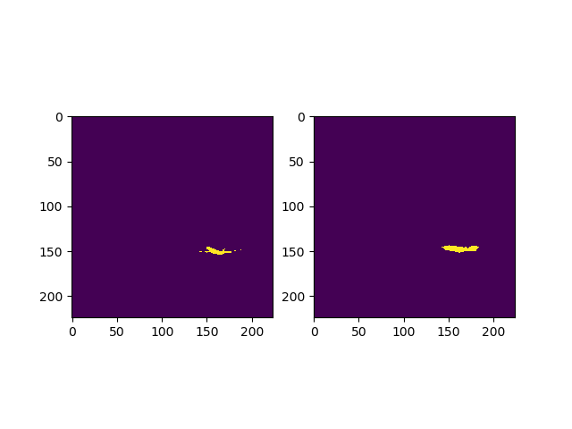
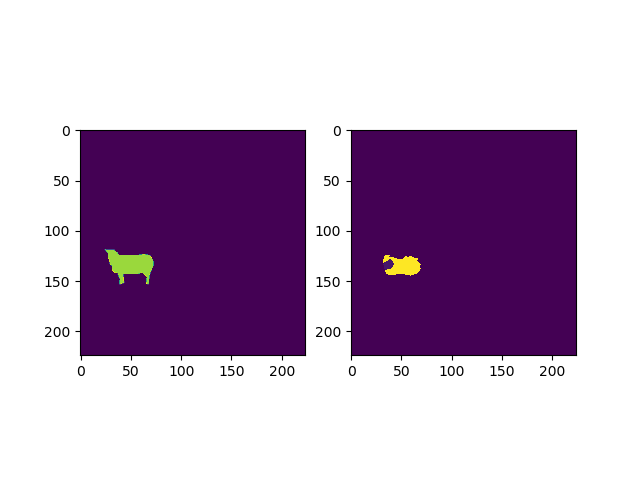
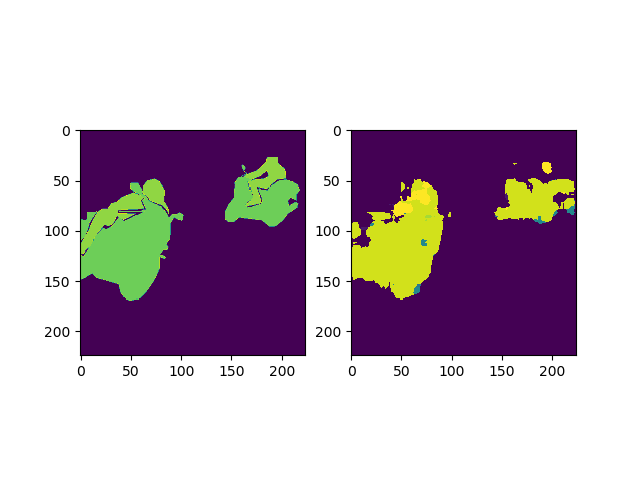
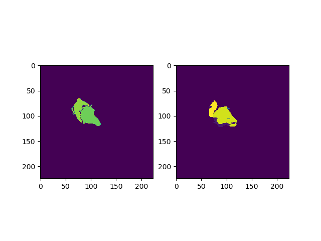
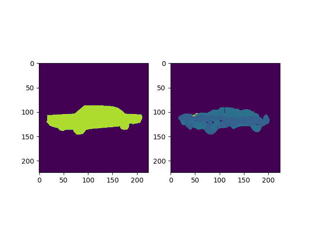
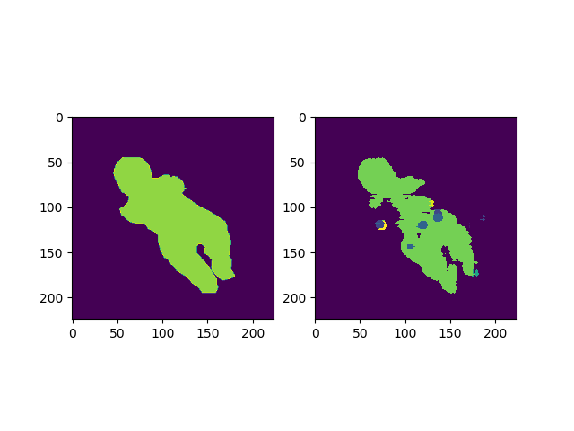
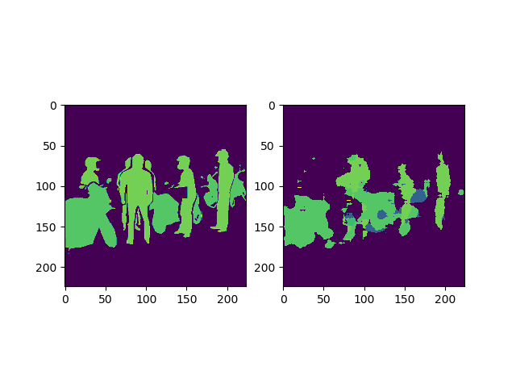
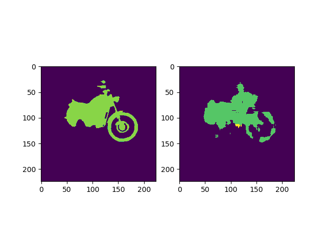
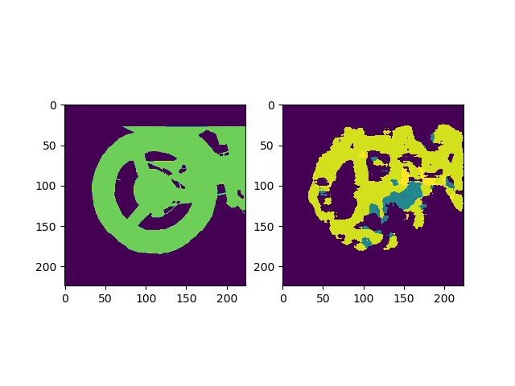
