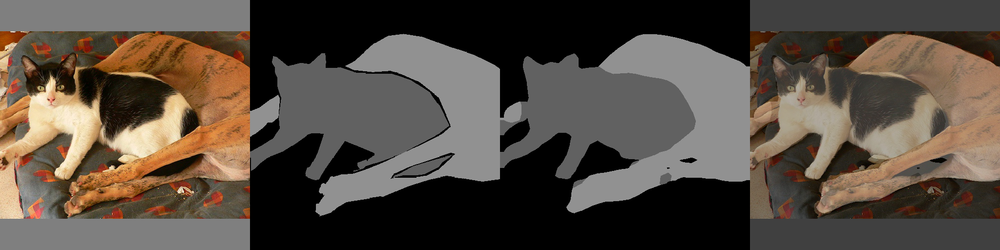
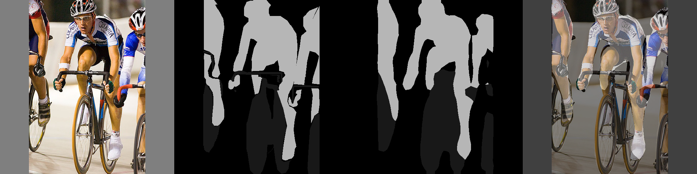
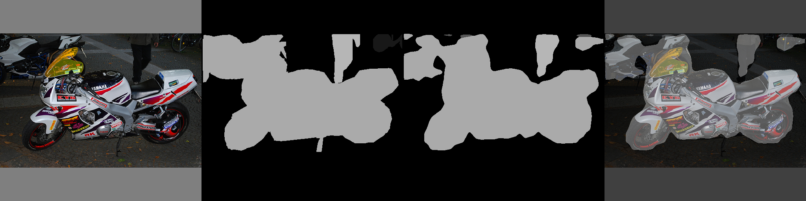

# Simplified Keras deeplabV3+ semantic segmentation model using Xception and MobileNetV2 as base models
## Simplified Keras based deeplabV3+ has been developed via referring to [Encoder-Decoder with Atrous Separable Convolution for Semantic Image Segmentation](https://arxiv.org/abs/1802.02611) and [the relevant github repository](https://github.com/tensorflow/models/tree/master/research/deeplab).

The deeplabV3+ semantic segmentation model is mainly composed of the encoder and decoder using atrous spatial pooling and separable depthwise convolution. As training data, [the augmented Pascal VOC 2012 data provided by DrSleep](https://www.dropbox.com/s/oeu149j8qtbs1x0/SegmentationClassAug.zip?dl=0) is used. These encoder and decoder become much more simplified and modularized, designing ASPP becomes simplified and flexible as the original deeplabv3+ model of deeplab, so you can design ASPP in the json format, and the boundary refinement layer is modularized, so you can use whether using the boundary refinement layer, or not according to your model's performance. 

# Tasks

- [x] Encoder develop.
- [x] Decoder develop.
- [x] Training and evaluating with Pasal VOC 2012 dataset.
- [x] Documentation.
- [x] The Keras framework is changed into the tensorflow 2.0 Keras framework.
- [x] Test and optimize the model.
- [x] Second documentation.

# Requirement

The simplified Keras deeplabV3+ semantic segmentation model is developed and tested on Tensorflow 2.0 and Python 3.6. To use it, Tensorflow 2.0 and Python 3.6 must be installed. OS and GPU environments are Linux Ubuntu 16.04 (16GB) with NVIDIA T4 GPU (16GB) and Windows 10 (16GB) without GPU. The procedure described below is focused on Linux.   

# Installation

```cd ~```

```git clone https://github.com/tonandr/deeplabv3plus_keras```

```cd deeplabv3plus_keras```

```python setup.py sdist bdist_wheel```

```pip install -e ./```

# Preparing data

As training data, the augmented Pascal VOC 2012 data is used, as validation, the orignal Pascal VOC 2012 is used, so the original Pascal VOC 2012 and augmented Pascal VOC 2012 must be downloaded and configured.

```mkdir resource```

```cd resource```

```wget http://pjreddie.com/media/files/VOCtrainval_11-May-2012.tar```

```tar -xvf VOCtrainval_11-May-2012.tar```

```wget https://www.dropbox.com/s/oeu149j8qtbs1x0/SegmentationClassAug.zip```

```unzip SegmentationClassAug.zip -d SegmentationClassAug```

```cp -r SegmentationClassAug/SegmentationClassAug VOCdevkit/VOC2012```

```cd VOCdevkit/VOC2012/ImageSets/Segmentation```

```wget https://www.dropbox.com/s/vrvelecbhqh2a4g/train_aug_val.txt```


# Neural network architecture and training strategy

Neural network configuration including neural network architecture and training strategy via hyper-parameters 
can be configured as the JSON format as below. ASPP can be designed in encoder_middle_conf. raw_data_path must be configured according to yours.

```cd ~```

```cd deeplabv3plus_keras/bodhi/deeplabv3plus_keras```

```
{
	"mode" : "train",
	"raw_data_path" : "/home/ubuntu/deeplabv3plus_keras/resource",
	"model_loading" : false,
	"multi_gpu" : false,
	"num_gpus" : 4,
	"eval_data_mode": 0,
	"eval_result_saving": false,
	"base_model": 1,
	"hps" : {
		"val_ratio": 0.1,
		"lr" : 0.00005,
		"beta_1" : 0.0,
		"beta_2" : 0.99,
		"decay" : 0.0,
		"epochs" : 64,
		"batch_size" : 6,
		"weight_decay": 0.001,
		"bn_momentum": 0.9,
		"bn_scale": true,
		"reduce_lr_factor": 0.99
	},
	"nn_arch" : {
		"boundary_refinement": true,
		"output_stride": 16,
		"image_size": 512,
		"num_classes": 21,
		"mv2_depth_multiplier": 1,
		"depth_multiplier": 1,
		"conv_rate_multiplier" : 1,
		"reduction_size": 256,
		"dropout_rate": 0.8,
		"concat_channels": 256,
		"encoder_middle_conf_city_scrapes": [
			{"kernel": 3, "rate": [1, 1], "op": "conv", "input": -1}, 
			{"kernel": 3, "rate": [18, 15], "op": "conv", "input": 0}, 
			{"kernel": 3, "rate": [6, 3], "op": "conv", "input": 1}, 
			{"kernel": 3, "rate": [1, 1], "op": "conv", "input": 0}, 
			{"kernel": 3, "rate": [6, 21], "op": "conv", "input": 0}
		],
		"encoder_middle_conf": [
			{"kernel": 3, "rate": [1, 1], "op": "conv", "input": -1}, 
			{"kernel": 3, "rate": [6, 6], "op": "conv", "input": 0}, 
			{"kernel": 3, "rate": [12, 12], "op": "conv", "input": 0}, 
			{"kernel": 3, "rate": [18, 18], "op": "conv", "input": 0}, 
			{"kernel": 1, "rate": [1, 1], "op": "pyramid_pooling", "input": 0, "target_size_factor": [1, 1]}
		]	 
	}
}
```

# Training

In semantic_segmentation_deeplabv3plus_conf.json, mode must be configured to "train". Boundary refinement requires much computing resource, so when training, the batch size should be within about 6, and when evaluating, the batch size should be within about 1. 

```python semantic_segmentation.py```

## Xception

The encoder middle configuration is as follows.

```
"encoder_middle_conf": [
			{"kernel": 3, "rate": [1, 1], "op": "conv", "input": -1}, 
			{"kernel": 3, "rate": [6, 6], "op": "conv", "input": 0}, 
			{"kernel": 3, "rate": [12, 12], "op": "conv", "input": 0}, 
			{"kernel": 3, "rate": [18, 18], "op": "conv", "input": 0}, 
			{"kernel": 1, "rate": [1, 1], "op": "pyramid_pooling", "input": 0, "target_size_factor": [1, 1]}
		]
```

## MobileNetV2

The encoder middle configuration is as follows.

```
"encoder_middle_conf": [
			{"kernel": 3, "rate": [1, 1], "op": "conv", "input": -1}, 
			{"kernel": 3, "rate": [18, 15], "op": "conv", "input": 0}, 
			{"kernel": 3, "rate": [6, 3], "op": "conv", "input": 1}, 
			{"kernel": 3, "rate": [1, 1], "op": "conv", "input": 0}, 
			{"kernel": 3, "rate": [6, 21], "op": "conv", "input": 0}
		]
```

# Evaluating

In semantic_segmentation_deeplabv3plus_conf.json, mode must be configured to "evaluate" and model_loading must be configured to "true", and eval_data_mode consisting of MODE_TRAIN of 0, MODE_VAL of 1 can be configured, and evaluation image results can be saved via configuring eval_result_saving.

```python semantic_segmentation.py```  

# Performance

Validation data of PASCAL VOC 2012 might be much biased and have much variation, so via splitting randomly shuffled total data consisting of augmented data and validation data, as training data and validation data, evaluation is conducted. The splitting ratio of validation data is 0.1.

## Xception

Differently to the original aligned Xception deeplabV3+, the pre-trained general Xception model is used as a base model. 

[You can download the trained model.](https://drive.google.com/open?id=1M4X3gQV-ogcUmSAwCazBWD2MLUrUYR-z)

### Mean IoU

| data type | training | validation |
|-----------|----------|------------|
| mean iou  |  0.885   |    0.879   |

### Segmentation results

Segmentation results are obtained using validation data.




[You can download segmentation results.](https://drive.google.com/open?id=1kvT_l7HkqYzCFAuwmVGt7dUXMqodBu_A)

## MobileNetV2

The pre-trained MobileNetV2 model is used as a base model. The segmentation performance is much lower than the Xception case.  

[You can download the trained model.](https://drive.google.com/open?id=1fywX00NiasppMvW3fGpHosxpXkrQ9jEY )

### Mean IoU

| data type | training | validation |
|-----------|----------|------------|
| mean iou  |  0.749   |   0.539    |

### Segmentation results

Segmentation results are obtained using validation data.



[You can download segmentation results.](https://drive.google.com/open?id=1XaUpQv-djJPR1IxiZjKeEPG4_eNTzC2_ )

# Next plan
With the COCO data set, semantic segmentation models will be trained and evaluated adding NASNetMobile and DenseNet121 as base models.
